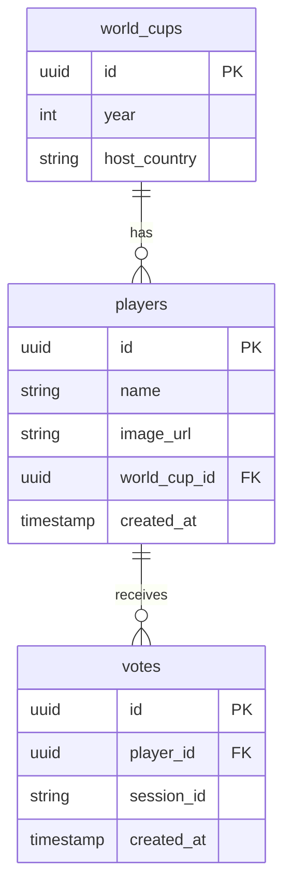

Modelo de Dados - Copa do Mundo

O banco de dados utiliza PostgreSQL (via Supabase). O modelo consiste em três tabelas principais: Copas do Mundo, Jogadores e Votos.
Diagrama ER (Mermaid)

```mermaid

erDiagram
    world_cups {
        uuid id PK
        int year
        string host_country
    }

    players {
        uuid id PK
        string name
        string image_url
        uuid world_cup_id FK
        timestamp created_at
    }

    votes {
        uuid id PK
        uuid player_id FK
        string session_id
        timestamp created_at
    }

    world_cups ||--o{ players : "has"
    players ||--o{ votes : "receives"

```

